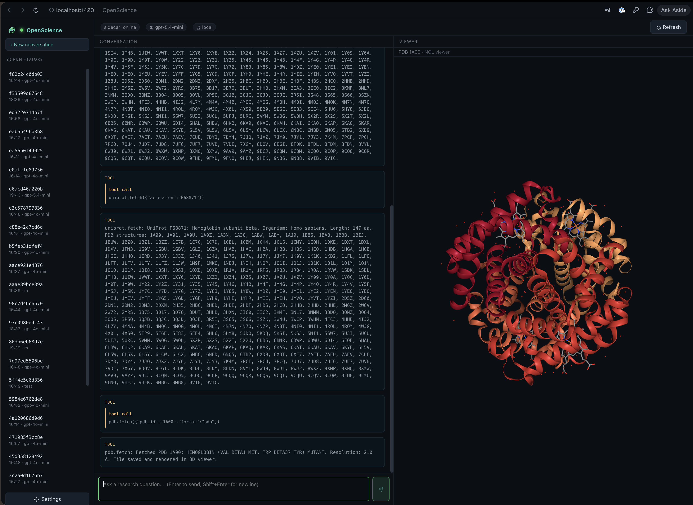

# OpenScience

An open-source scientific AI workbench. An open alternative to proprietary
research assistants: connects to scientific databases, renders 3D protein
structures / genome tracks / chemical structures, runs and plots code locally
or over SSH/Slurm, drafts manuscripts with real citations, and tracks every
result for reproducibility.

Works with **any OpenAI-compatible endpoint** — bring your own model: OpenAI,
Ollama, vLLM, Together, Groq, OpenRouter, Azure OpenAI, local Llama, etc.
Every scientific data source it talks to is a **free, no-auth public API**, and
code runs on your own machine — so the whole stack works with **zero paid API
keys** when paired with a local model like Ollama.

Licensed under the **MIT License**.

> **Platform support:** OpenScience currently supports **macOS on Apple Silicon (M1 or later)** only. Windows, Linux, and Intel Mac releases are not available yet.



---

## Architecture (v0.2)

```
┌──────────────────────────────────────────────────────────────┐
│ Tauri shell (Rust)                                            │
│  • spawns/manages Python sidecar on app launch                │
│  • window + IPC bridge                                        │
└──────────┬───────────────────────────────────────────────────┘
           │ HTTP/SSE on localhost
┌──────────▼───────────────────────────────────────────────────┐
│ Python sidecar (FastAPI, uv-managed)                          │
│  • /chat              streaming agentic loop + tool dispatch  │
│  • /tools             list registered scientific tools (25)   │
│  • /runs              list + read reproducibility runs        │
│  • /review            automated reviewer (fact-check pass)    │
│  • /compute           list + configure compute backends       │
│  • /manuscript/export assemble + export Markdown/LaTeX/PDF    │
│                                                               │
│  LLM client      OpenAI-compatible; ReAct fallback            │
│  Tools           25 connectors (see below)                    │
│  Compute         Local + SSH (paramiko) + Slurm wrappers      │
│  Recorder        per-run manifest + conversation + outputs    │
└───────────────────────────────────────────────────────────────┘
           ▲
           │ fetch + SSE
┌──────────┴───────────────────────────────────────────────────┐
│ React UI (Vite + TypeScript + Mantine)                        │
│  • Conversation | Viewer / Run Inspector / Manuscript         │
│  • Sidebar: New conversation + run history + Settings         │
│  • Viewers: NGL (protein), FASTA/GC (genome), RDKit (chem),   │
│             FigureViewer (png/svg/html/pdf from code.run)     │
│  • Settings: endpoint URL, API key, model, tool toggle, SSH   │
└───────────────────────────────────────────────────────────────┘
```

### Tools (25, all free / no-auth public APIs)

| Area | Tools |
|------|-------|
| Structures | `pdb.fetch/search`, `alphafold.fetch`, `uniprot.fetch` |
| Genomics / variants | `entrez.search/fetch`, `ensembl.lookup/sequence/variants`, `clinvar.search/fetch`, `geo.search/fetch` |
| Chemistry | `chembl.fetch/search` |
| Literature | `pubmed.search/fetch`, `europepmc.search` |
| Citations | `crossref.fetch`, `crossref.cite` (BibTeX / RIS / CSL-JSON) |
| Code & compute | `code.run` (Python/R + figures), `compute.run`, `slurm.submit/status/cancel` |

### Reproducibility — the "Run"

Every chat exchange is captured into an append-only Run:

```
~/.openscience/runs/<run_id>/
├── manifest.json     # model, params, pip freeze, git hash, host
├── conversation.json # every user msg, assistant msg, tool call+result
├── outputs/          # artifacts (PDB files, FASTA, etc.) — SHA-256 prefixed
└── review.json       # automated reviewer verdict (written last)
```

Anyone on a team can verify a result by reading the Run and re-executing
the recorded tool calls.

### Automated reviewer

A second LLM pass (no tools) walks the conversation and verifies every
numeric claim and citation against tool outputs. Verdicts:
`pass` (everything traces), `flag` (some claims unverified), `fail`
(claims contradicted). Stored in `review.json`.

### Code execution, figures & manuscripts (v0.2)

- **`code.run`** executes Python (or R) on the local machine or over SSH/Slurm,
  captures stdout/stderr, and persists matplotlib/plotly figures as `figure`
  viewer artifacts. The executed source is recorded in the run.
- **Editable-by-chat figures**: ask "change the x-axis to log scale" and the
  model rewrites and re-runs the plotting code — the figure updates from the
  new source, not by editing the image.
- **Manuscript panel**: pin assistant drafts into sections, insert figures from
  `code.run` and citations from `crossref.cite`, then export to Markdown/LaTeX/PDF
  (via `pandoc` when installed). The assembled manuscript and bibliography are
  saved to the run for reproducibility.

---

## Quick start

### Install the macOS app

Download the Apple Silicon `.app` ZIP from the [GitHub release](https://github.com/virajshoor/openscience/releases/tag/v0.3.1). Drag OpenScience into Applications and open it. The release contains its own sidecar, so it does not require Python or `uv`.

The release is **signed and notarized** with a Developer ID certificate. If you build it yourself from source it will be unsigned — see [Signing the app](#signing-the-app) below.

### Prerequisites

- macOS 14+ on Apple Silicon (M1 or later)
- [Node.js](https://nodejs.org) 20+
- [pnpm](https://pnpm.io) (`npm i -g pnpm`)
- [Rust](https://rustup.rs) stable
- [uv](https://docs.astral.sh/uv/) (`curl -LsSf https://astral.sh/uv/install.sh | sh`)
- Xcode CLI tools (`xcode-select --install`)

### Install

```bash
# from repo root
pnpm install              # JS deps
cd sidecar && uv sync && cd ..   # Python deps
```

### Run the full app (Tauri + sidecar together)

```bash
pnpm tauri dev
```

The Tauri shell launches the Vite dev server, spawns the Python sidecar,
and waits for it to report healthy before showing the window. Sidecar
logs go to your terminal; UI logs to the browser devtools.

### Run pieces individually (recommended for first test)

You can run the sidecar standalone to verify the backend, then point the
UI at it. This is the fastest way to test without a full Tauri build:

```bash
# Terminal 1 — start the sidecar
cd sidecar
OS_SIDECAR_PORT=7100 OS_RUNS_DIR=~/.openscience/runs uv run python -m sidecar.__main__
```

```bash
# Terminal 2 — quick sanity check
curl http://127.0.0.1:7100/health
# {"ok":true,"tools":25}

curl http://127.0.0.1:7100/tools | python -m json.tool
```

```bash
# Terminal 2 — run the UI in dev mode (Vite, opens in browser)
pnpm dev
# → http://localhost:1420
```

The UI talks to the sidecar over HTTP at `http://127.0.0.1:7100`. Configure
your model endpoint in the Settings modal (gear icon in the sidebar):

| Field             | Example                                                          |
|-------------------|------------------------------------------------------------------|
| Endpoint          | `https://api.openai.com/v1` (or `http://localhost:11434/v1` for Ollama) |
| API key           | `sk-...` (any non-empty string for local providers)              |
| Model             | `gpt-5.4-mini` (or `llama3.1`, `qwen2.5`, etc.)                  |
| Use tool-calling  | ✓ for OpenAI/Together/Groq; ✗ for some Ollama models (auto ReAct) |

### Configuration and security

Endpoint, model, and tool preferences are stored in `~/.openscience/config.json`.
Your API key is stored separately in the macOS Keychain and is not committed,
included in run manifests, or written to browser localStorage.

### Try it

In the chat box, type things like:

- `Fetch UniProt P12345 and find any PDB structures for it`
- `Show me the 3D structure of 1CRN` (loads NGL protein viewer)
- `Look up aspirin on ChEMBL and render it` (loads RDKit 2D viewer)
- `Search NCBI for BRCA1 human and fetch the first hit as FASTA` (genome viewer)

Each exchange creates a Run. Click a run in the sidebar to open the
Run Inspector, then click **Run reviewer** to fact-check it.

---

## Project layout

```
openscience/
├── src/                          # React UI
│   ├── App.tsx                   # 3-pane layout + sidebar
│   ├── components/
│   │   ├── ChatPanel.tsx
│   │   ├── ViewerPanel.tsx        # routes to protein/genome/chem/figure viewer
│   │   ├── RunInspector.tsx       # manifest + conversation + review + jobs
│   │   ├── RunHistory.tsx
│   │   ├── SettingsModal.tsx      # endpoint + compute (local/ssh/slurm) + SSH
│   │   ├── ManuscriptPanel.tsx    # assemble + export manuscript
│   │   └── viewers/
│   │       ├── ProteinViewer.tsx  # NGL
│   │       ├── GenomeViewer.tsx   # FASTA + GC tracks
│   │       ├── ChemViewer.tsx     # RDKit-JS (WASM, bundled)
│   │       └── FigureViewer.tsx   # png/svg/html/pdf from code.run
│   ├── lib/
│   │   ├── api.ts                 # sidecar client + SSE stream
│   │   └── types.ts
│   └── stores/session.ts         # zustand (persisted config)
├── sidecar/                       # Python package
│   ├── sidecar/
│   │   ├── server.py              # FastAPI app
│   │   ├── llm/
│   │   │   ├── client.py           # streaming + tool dispatch
│   │   │   ├── react.py            # ReAct text-loop fallback
│   │   │   └── reviewer.py        # automated fact-checker
│   │   ├── tools/
│   │   │   ├── registry.py        # @tool decorator
│   │   │   ├── uniprot.py  pdb.py  entrez.py  chembl.py
│   │   │   ├── code.py            # Python/R execution + figures
│   │   │   ├── compute.py         # compute.run + slurm.*
│   │   │   ├── ensembl.py  clinvar.py  geo.py  alphafold.py
│   │   │   └── pubmed.py  europepmc.py  crossref.py
│   │   ├── repro/
│   │   │   └── recorder.py        # Run persistence
│   │   └── compute/
│   │       ├── base.py
│   │       ├── local.py
│   │       └── ssh.py             # paramiko + sbatch/squeue
│   └── pyproject.toml
├── src-tauri/                     # Rust shell
│   ├── src/
│   │   ├── main.rs
│   │   ├── lib.rs                 # app entry + IPC commands
│   │   └── sidecar.rs             # spawn/supervise Python process
│   └── tauri.conf.json
└── package.json
```

---

## Adding tools

A tool is just an async function with a JSON schema. Drop a file in
`sidecar/sidecar/tools/`, decorate with `@tool`, and it auto-registers:

```python
from .registry import tool

@tool(
    "my_tool.do_thing",
    "Does the thing to X.",
    {"type": "object", "properties": {"x": {"type": "string"}}, "required": ["x"]},
)
async def do_thing(x: str, recorder=None, run_id=None) -> dict:
    return {"summary": f"Did thing to {x}.", "data": {"x": x}}
```

If you return a `viewer` field, the UI renders it:

```python
return {
    "summary": "...",
    "viewer": {"type": "protein", "src": "runs/<id>/outputs/foo.pdb", "label": "Foo"},
}
```

Viewer types: `protein` (NGL), `genome` (FASTA), `chem` (RDKit, SMILES), `figure` (png/svg/html/pdf). A tool may also return a `viewers` list to emit several artifacts at once.

---

## Build a release binary

```bash
pnpm tauri build
# → bundle in src-tauri/target/release/bundle/
```

The DMG step can fail on some machines; the `.app` under
`src-tauri/target/release/bundle/macos/` is the reliable artifact. Zip it with:

```bash
ditto -c -k --keep-parent src-tauri/target/release/bundle/macos/OpenScience.app OpenScience.app.zip
```

---

## Signing the app

The published macOS build is signed with a **Developer ID Application**
certificate and notarized with `notarytool`. To reproduce from source:

1. Ensure a "Developer ID Application: <Your Name> (TEAMID)" certificate is
   installed in Keychain, and you have an app-specific password from
   <https://appleid.apple.com>.

2. Store notarytool credentials (one time):
   ```bash
   xcrun notarytool store-credentials "OpenScience-notary" \
     --apple-id "you@example.com" \
     --team-id "TEAMID" \
     --password "app-specific-password"
   ```

3. Build, then sign and notarize:
   ```bash
   pnpm tauri build
   APP="src-tauri/target/release/bundle/macos/OpenScience.app"
   IDENTITY="Developer ID Application: Your Name (TEAMID)"

   # Sign the sidecar binary first, then the app bundle (deep, timestamped, hardened runtime)
   codesign --force --options runtime --timestamp --sign "$IDENTITY" \
     "$APP/Contents/MacOS/openscience-sidecar"
   codesign --force --deep --options runtime --timestamp --sign "$IDENTITY" "$APP"
   # Verify
   codesign --verify --strict --verbose=2 "$APP"

   # Submit for notarization, wait, then staple
   ditto -c -k --keepParent "$APP" /tmp/OpenScience.zip
   xcrun notarytool submit /tmp/OpenScience.zip --keychain-profile "OpenScience-notary" --wait
   xcrun stapler staple "$APP"
   xcrun stapler validate "$APP"
   ```

The signing identity hash can be used instead of the full name if multiple
certificates share a name: `codesign --sign <SHA-1> ...`. Find it with
`security find-identity -v -p codesigning`.

---

## Roadmap

v0.1:
- ✓ OpenAI-compatible chat with streaming + tool dispatch
- ✓ ReAct text-loop fallback for providers without tool-calling
- ✓ DB connectors: UniProt, PDB, NCBI Entrez, ChEMBL
- ✓ 3 viewers: NGL protein, FASTA+GC genome, RDKit chemistry
- ✓ Local + SSH/Slurm compute backends
- ✓ Reproducibility recorder with manifest + conversation + outputs
- ✓ Automated reviewer

v0.2:
- ✓ Code execution (`code.run`) — Python/R on local/SSH/Slurm with figures
- ✓ Editable-by-chat figures (model rewrites plotting code, not the image)
- ✓ FigureViewer for png/svg/html/pdf
- ✓ Compute management tools (`compute.run`, `slurm.submit/status/cancel`)
- ✓ New databases: Ensembl, ClinVar, GEO, AlphaFold DB
- ✓ Literature: PubMed, Europe PMC
- ✓ Citations: Crossref metadata + BibTeX/RIS/CSL export
- ✓ Manuscript panel with Markdown/LaTeX/PDF export
- ✓ 25 tools total (all free / no-auth public APIs)

v0.3 (this release):
- ✓ Session branching — fork a run into a new branch from the Run Inspector
- ✓ User-created specialist agents (system prompt + tool whitelist) via Settings
- ✓ Reusable skills (saved prompts/pipelines) invokable from the top bar
- ✓ Approval-before-spend — `compute.run`/`slurm.submit` draft a plan and wait
  for confirmation before allocating resources
- ✓ Plain-English provenance — every `code.run` output records the source, tool,
  backend, and how it was generated (viewable in the Run Inspector)
- ✓ Robust sidecar port discovery (self-heals when port 7100 is held)
- ✓ Signed + notarized macOS build

v0.4 (planned):
- Native interactive genome browser tracks (igv.js)
- Persistent loaded datasets across a session
- Multi-run diffing
- NVIDIA BioNeMo integration (requires user-provided GPU infrastructure)

---

## License

MIT License. See [LICENSE](./LICENSE).
